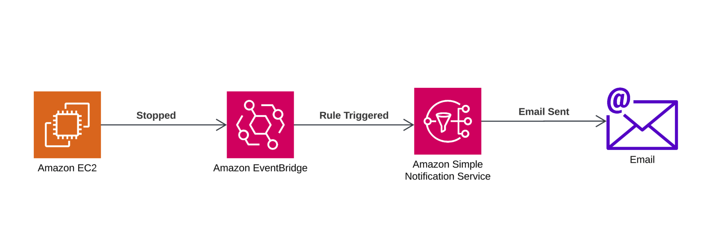

# AWS Event-Driven EC2 Monitoring System

## Overview
This project implements an automated event-driven monitoring system for Amazon EC2 instances using **Amazon EventBridge** and **Amazon Simple Notification Service (SNS)**. The system is designed to notify users via email whenever an EC2 instance is stopped. This ensures real-time awareness of critical infrastructure state changes, allowing for proactive response.

## Architecture
The workflow follows these key steps:
1. **Amazon EC2 Instance**: An instance is created and monitored for state changes.
2. **Amazon EventBridge Rule**: A rule is configured to trigger on the EC2 `stopped` event.
3. **Amazon SNS Topic**: The EventBridge rule routes notifications to an SNS topic.
4. **Email Notification**: SNS sends an email notification to the subscribed user upon event trigger.

## Prerequisites
Before setting up the system, ensure the following:
- An active **AWS account** with necessary IAM permissions.
- Access to **Amazon EC2**, **Amazon EventBridge**, and **Amazon SNS** services.
- An email address for receiving notifications.

## Setup Instructions
### 1. Create an EC2 Instance
1. Navigate to **EC2 Dashboard** in AWS Console.
2. Click **Launch Instance**.
3. Select an Amazon Machine Image (AMI).
4. Choose instance type (e.g., t2.micro for free-tier eligibility).
5. **Proceed without a key pair** (for testing purposes).
6. Configure security group rules as per requirements.
7. Click **Launch**.

### 2. Create an SNS Topic
1. Open the **Amazon SNS Dashboard**.
2. Click **Create Topic**.
3. Choose **Standard** topic.
4. Provide a **Topic Name** (e.g., `EC2StateChangeNotification`).
5. Click **Create Topic**.

### 3. Create an SNS Subscription
1. Open the **Amazon SNS Dashboard**.
2. Click **Create Subscription**.
3. Select the **Topic ARN** created earlier.
4. Choose **Email** as the protocol.
5. Enter the recipient email address.
6. Click **Create Subscription**.
7. **Confirm subscription** from the email received.

### 4. Configure an EventBridge Rule
1. Open the **Amazon EventBridge Console**.
2. Click **Rules** and then **Create Rule**.
3. Enter a **Rule Name** (e.g., `EC2StoppedNotification`).
4. Under **Define pattern**, select **Event pattern**.
5. Choose **AWS Service** and select **EC2**.
6. Specify **Event Type** as `EC2 Instance State-change Notification`.
7. Select the state as `stopped`.
8. Choose **Target** as **SNS topic** and select the topic created earlier.
9. Click **Create**.

### 5. Test the System
1. Go to **EC2 Dashboard**.
2. Select the instance and click **Stop**.
3. Wait for the instance to transition to `stopped` state.
4. Check the email inbox for a notification from **Amazon SNS**.

## Cleanup
To avoid unnecessary costs, clean up the resources:
1. **Delete EC2 Instance**: Terminate the instance from the EC2 dashboard.
2. **Delete SNS Topic**: Remove the topic from SNS to stop notifications.
3. **Delete SNS Subscription**: Unsubscribe from the SNS topic.
4. **Delete EventBridge Rule**: Remove the rule from EventBridge.

## Conclusion
This project demonstrates an efficient, event-driven notification system leveraging AWS **EventBridge** and **SNS** to monitor EC2 instance state changes. It is a scalable and robust solution to improve infrastructure monitoring and alerting.

---
🚀 **Built with AWS Cloud Services for Real-Time Monitoring** 🚀

