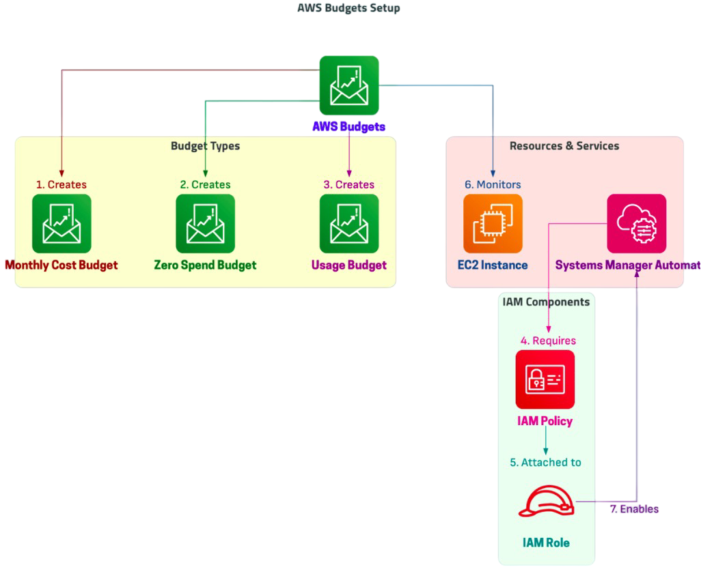

# AWS Budgets - Comprehensive Setup and Automation Guide

## Overview
This project demonstrates a powerful AWS Budgets setup to monitor and control cloud costs. It includes budget creation, automated cost management, IAM policy configurations, and EC2 automation using AWS Systems Manager.

## Steps Covered:
1. **Create a Monthly Cost Budget**
2. **Create a Zero Spend Budget**
3. **Launch an EC2 Instance for EC2 Hours Budget**
4. **Create a Permissions Policy for Systems Manager Automation**
5. **Create an IAM Role and Attach the Permissions Policy**
6. **Create a Usage Budget**
7. **Cleanup of All Resources Created**




## AWS Budgets Setup

### 1. Create a Monthly Cost Budget
   - Navigate to **AWS Budgets** via the AWS Console.
   - Click on **Create a Budget**.
   - Select **Cost Budget** and configure:
     - **Name:** `Monthly-Cost-Budget-1`
     - **Amount:** `$10.00`
     - **Notification Email:** `learnpde@gmail.com`
   - Set up alerts and thresholds.
   - Click **Create Budget**.

### 2. Create a Zero Spend Budget
   - Repeat the process above but select **Zero Spend Budget**.
   - Configure:
     - **Name:** `My Zero-Spend Budget`
     - **Notification Email:** `learnpde@gmail.com`
   - Click **Create Budget**.

### 3. Launch an EC2 Instance for Budget Tracking
   - Navigate to **EC2** and launch an instance.
   - Name it: `EC2-Hours-Budget-Demo`
   - Choose an appropriate AMI and instance type.
   - Configure security settings and permissions.
   - Launch the instance.

### 4. Create a Permissions Policy for AWS Systems Manager Automation
   - Navigate to **IAM Policies**.
   - Click **Create Policy**.
   - Choose **JSON** and paste the following policy:
     ```json
     {
         "Version": "2012-10-17",
         "Statement": [
             {
                 "Effect": "Allow",
                 "Action": [
                     "ec2:StopInstances",
                     "ec2:DescribeInstances",
                     "ssm:StartAutomationExecution",
                     "ssm:GetAutomationExecution",
                     "ssm:StopAutomationExecution"
                 ],
                 "Resource": "*"
             }
         ]
     }
     ```
   - Name the policy: `Systems-Manager-Inline-Policy`
   - Click **Create Policy**.

### 5. Create an IAM Role for AWS Budgets to Execute Automation
   - Navigate to **IAM Roles**.
   - Click **Create Role**.
   - Choose **AWS Service** → **EC2**.
   - Attach the `Systems-Manager-Inline-Policy`.
   - Name the role: `BudgetActions-Role`.
   - Click **Create Role**.

### 6. Create a 3rd Budget: Usage Budget
   - Navigate to **AWS Budgets**.
   - Click **Create Budget**.
   - Select **Usage Budget**.
   - Configure:
     - **Name:** `EC2-Hours-Usage-Budget`
     - **Set threshold and alert conditions**.
   - Click **Create Budget**.

### 7. Cleanup of All Resources
   - **Delete Budgets**
     - Navigate to **AWS Budgets** → **Delete all created budgets**.
   - **Terminate EC2 Instance**
     - Navigate to **EC2** → **Select `EC2-Hours-Budget-Demo`** → **Terminate**.
   - **Delete IAM Policy**
     - Navigate to **IAM Policies** → **Delete `Systems-Manager-Inline-Policy`**.
   - **Delete IAM Role**
     - Navigate to **IAM Roles** → **Delete `BudgetActions-Role`**.

## Conclusion
This comprehensive AWS Budgets setup ensures that cloud costs are effectively managed while integrating automation using IAM roles and Systems Manager. This method provides robust cost control, automated enforcement, and enhanced security for cloud environments.

