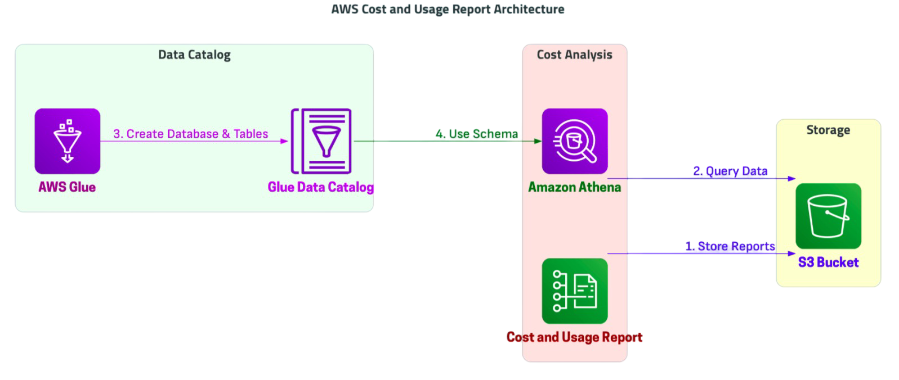

# AWS Managed Streaming for Apache Kafka (MSK) - README

## Overview
Amazon Managed Streaming for Apache Kafka (MSK) is a fully managed service that makes it easy to build and run applications that use Apache Kafka for real-time data processing. This document provides a step-by-step guide to setting up an MSK cluster, configuring IAM policies, creating topics, producing and consuming messages, and cleaning up resources.

---

## General Design Solution: 




## Prerequisites
Ensure you have the following:
- An **AWS Account**
- AWS CLI installed and configured
- Terraform (if provisioning infrastructure using IaC)
- EC2 instance with Apache Kafka client tools installed
- IAM permissions to create and manage MSK clusters

---

## Step 1: Create an Amazon MSK Cluster
### Using AWS Console
1. Navigate to **Amazon MSK** in AWS Console.
2. Click **Create Cluster**.
3. Choose **Custom create** and configure:
   - **Cluster Name:** `msk-cluster-demo`
   - **Kafka Version:** Latest available
   - **Broker Type:** `kafka.t3.small` (for testing)
   - **Number of Brokers:** 3 (Minimum for HA)
   - **VPC & Subnets:** Select appropriate VPC and subnets
   - **Security Group:** Ensure EC2 instance can access MSK
   - **Encryption:** Enable both at-rest and in-transit encryption
4. Click **Create Cluster** and wait for provisioning.

### Using AWS CLI
```sh
aws kafka create-cluster \
    --cluster-name msk-cluster-demo \
    --kafka-version 2.8.1 \
    --number-of-broker-nodes 3 \
    --broker-node-group-info "{"instanceType":"kafka.t3.small","clientSubnets":["subnet-xyz"],"securityGroups":["sg-abc"]}"
```

---

## Step 2: Configure IAM Policies
Create an **IAM policy** for accessing MSK.

```json
{
  "Version": "2012-10-17",
  "Statement": [
    {
      "Effect": "Allow",
      "Action": [
        "kafka:DescribeCluster",
        "kafka:GetBootstrapBrokers",
        "kafka:ListTopics",
        "kafka:CreateTopic",
        "kafka:DeleteTopic"
      ],
      "Resource": "*"
    }
  ]
}
```

Attach this policy to an **IAM Role** that the EC2 instance will assume.

---

## Step 3: Launch an EC2 Instance
Launch an EC2 instance in the **same VPC** as MSK and install Kafka CLI tools.

```sh
sudo yum install -y java-11-amazon-corretto
wget https://archive.apache.org/dist/kafka/2.8.1/kafka_2.13-2.8.1.tgz
```

Unzip and navigate to the Kafka directory:
```sh
tar -xzf kafka_2.13-2.8.1.tgz
cd kafka_2.13-2.8.1
```

---

## Step 4: Get Bootstrap Brokers
```sh
aws kafka get-bootstrap-brokers --cluster-arn <your-cluster-arn>
```
Copy the bootstrap server addresses.

---

## Step 5: Create a Kafka Topic
```sh
bin/kafka-topics.sh --create --topic demo-topic --bootstrap-server <bootstrap-brokers> --replication-factor 3 --partitions 1
```

Verify topic creation:
```sh
bin/kafka-topics.sh --list --bootstrap-server <bootstrap-brokers>
```

---

## Step 6: Produce and Consume Messages

### Producing Messages
```sh
bin/kafka-console-producer.sh --topic demo-topic --bootstrap-server <bootstrap-brokers>
```
Type messages and hit **Enter**.

### Consuming Messages
```sh
bin/kafka-console-consumer.sh --topic demo-topic --bootstrap-server <bootstrap-brokers> --from-beginning
```

---

## Step 7: Testing the Setup
Use Apache Kafka CLI to test message flow.

1. Open two terminal sessions.
2. In the first session, run the consumer.
3. In the second session, run the producer and send messages.
4. Ensure messages appear in the consumer terminal.

---

## Step 8: Cleanup
### Delete Kafka Topic
```sh
bin/kafka-topics.sh --delete --topic demo-topic --bootstrap-server <bootstrap-brokers>
```

### Delete MSK Cluster
```sh
aws kafka delete-cluster --cluster-arn <your-cluster-arn>
```

### Terminate EC2 Instance
```sh
aws ec2 terminate-instances --instance-ids <instance-id>
```

---

## Conclusion
This guide provides a full workflow for deploying an **Amazon MSK Cluster**, configuring Kafka topics, producing and consuming messages, and cleaning up resources. For production use, consider **scaling brokers, enabling monitoring (CloudWatch, Prometheus), and securing IAM policies**.

---
