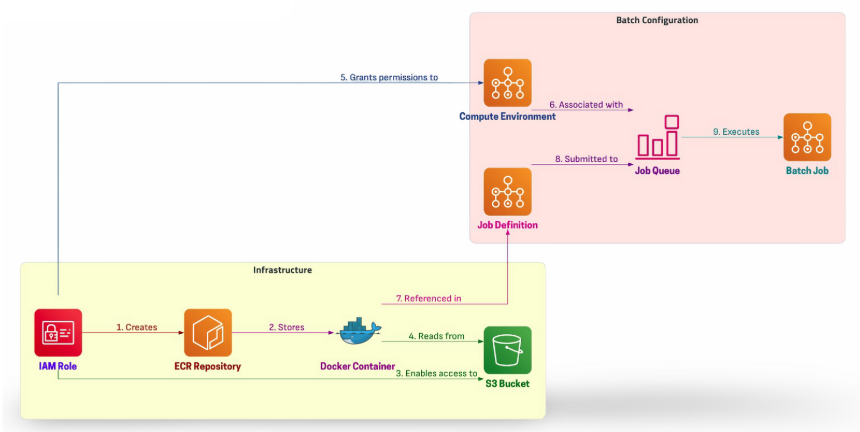

# AWS Batch: Scalable Data Processing Pipeline

## Overview
This project demonstrates a **powerful and scalable AWS Batch-based data processing pipeline** leveraging AWS services such as **IAM, ECR, S3, Docker, and AWS Batch** to process structured datasets efficiently.

## General Design Solution: 




The pipeline follows an automated workflow:
1. **Set up IAM roles and permissions** for secure execution.
2. **Create and manage S3 Buckets** for input/output data storage.
3. **Build and push a Dockerized processing application** to AWS Elastic Container Registry (ECR).
4. **Configure AWS Batch Compute Environment** for optimized resource allocation.
5. **Define AWS Batch Job Queues and Job Definitions** to manage workload execution.
6. **Submit jobs and process data** dynamically.
7. **Clean up resources after execution** to maintain cost efficiency.

---

## **1. Setup IAM Role**
### **Create IAM Role for AWS Batch Execution**
The **IAM Role** provides necessary permissions for AWS Batch to pull images, execute containers, and access S3.

#### **Create Role and Attach Policies**
```sh
aws iam create-role \
    --role-name ECSTaskExecutionRole \
    --assume-role-policy-document file://ecs-trust-policy.json

aws iam attach-role-policy \
    --role-name ECSTaskExecutionRole \
    --policy-arn arn:aws:iam::aws:policy/service-role/AmazonECSTaskExecutionRolePolicy

aws iam attach-role-policy \
    --role-name ECSTaskExecutionRole \
    --policy-arn arn:aws:iam::aws:policy/AmazonS3FullAccess
```

---
## **2. Create and Configure AWS S3**
### **Create S3 Bucket & Upload Sample Data**
```sh
TIMESTAMP=$(date +%Y%m%d%H%M%S)
BUCKET_NAME="batch-demo-${TIMESTAMP}"

aws s3api create-bucket \
    --bucket ${BUCKET_NAME} \
    --region us-east-1

# Create input and output folders
aws s3api put-object --bucket ${BUCKET_NAME} --key input/
aws s3api put-object --bucket ${BUCKET_NAME} --key output/
```

### **Upload Sample Data**
```sh
cat << 'EOF' > data.csv
month,revenue,costs,units_sold,customer_count,avg_order_value
Jan_2024,120500.50,85000.75,1250,850,96.40
Feb_2024,135750.25,92500.50,1380,920,98.35
EOF

aws s3 cp data.csv s3://${BUCKET_NAME}/input/data.csv
```

---
## **3. Create and Push Docker Image to AWS ECR**
### **Create ECR Repository**
```sh
aws ecr create-repository --repository-name batch-demo-app
```

### **Define the Processing Application**
#### **Python Processing Script (`process_data.py`)**
```python
import boto3
import pandas as pd
import os
import sys
import logging
from datetime import datetime

logging.basicConfig(level=logging.INFO)
logger = logging.getLogger(__name__)

def process_file(input_bucket, input_key, output_bucket, output_key):
    s3 = boto3.client('s3')
    try:
        local_input = f'/tmp/input_{datetime.now().strftime("%Y%m%d_%H%M%S")}.csv'
        s3.download_file(input_bucket, input_key, local_input)
        df = pd.read_csv(local_input)
        numeric_columns = df.select_dtypes(include=['float64', 'int64']).columns
        result = pd.DataFrame({
            'column': numeric_columns,
            'mean': df[numeric_columns].mean(),
            'median': df[numeric_columns].median(),
            'std': df[numeric_columns].std()
        })
        local_output = f'/tmp/output_{datetime.now().strftime("%Y%m%d_%H%M%S")}.csv'
        result.to_csv(local_output, index=False)
        s3.upload_file(local_output, output_bucket, output_key)
    except Exception as e:
        logger.error(f"Error processing file: {str(e)}")
        raise

if __name__ == "__main__":
    if len(sys.argv) != 5:
        sys.exit(1)
    process_file(sys.argv[1], sys.argv[2], sys.argv[3], sys.argv[4])
```

#### **Dockerfile**
```dockerfile
FROM python:3.9-slim
WORKDIR /app
COPY requirements.txt .
RUN pip install --no-cache-dir -r requirements.txt
COPY process_data.py .
ENTRYPOINT ["python", "process_data.py"]
```

#### **Build and Push Docker Image**
```sh
aws ecr get-login-password | docker login --username AWS --password-stdin <account-id>.dkr.ecr.us-east-1.amazonaws.com

docker build -t batch-demo-app .

docker tag batch-demo-app:latest <account-id>.dkr.ecr.us-east-1.amazonaws.com/batch-demo-app:latest

docker push <account-id>.dkr.ecr.us-east-1.amazonaws.com/batch-demo-app:latest
```

---
## **4. Configure AWS Batch Compute Environment & Job Queue**
```sh
aws batch create-compute-environment \
    --compute-environment-name BatchComputeEnvironment \
    --type MANAGED \
    --state ENABLED \
    --compute-resources type=FARGATE,maxvCpus=16,subnets=<subnet-ids>,securityGroupIds=<security-group-ids>,region=us-east-1,instanceRole=ecsInstanceRole
```

```sh
aws batch create-job-queue \
    --job-queue-name BatchJobQueue \
    --state ENABLED \
    --priority 1 \
    --compute-environment-order computeEnvironment=BatchComputeEnvironment,order=1
```

---
## **5. Create Job Definition & Submit Job**
```sh
aws batch register-job-definition \
    --job-definition-name BatchJobDefinition \
    --type container \
    --container-properties "{\"image\":\"<account-id>.dkr.ecr.us-east-1.amazonaws.com/batch-demo-app:latest\", \"memory\":1024, \"vcpus\":1, \"command\":[\"Ref::input_bucket\", \"Ref::input_key\", \"Ref::output_bucket\", \"Ref::output_key\"]}"
```

```sh
aws batch submit-job \
    --job-name BatchProcessingJob \
    --job-queue BatchJobQueue \
    --job-definition BatchJobDefinition \
    --parameters input_bucket=${BUCKET_NAME},input_key=input/data.csv,output_bucket=${BUCKET_NAME},output_key=output/results.csv
```

---
## **6. Clean Up Resources**
```sh
aws batch update-compute-environment --compute-environment-name BatchComputeEnvironment --state DISABLED
aws batch delete-compute-environment --compute-environment-name BatchComputeEnvironment
aws batch delete-job-queue --job-queue-name BatchJobQueue
aws batch deregister-job-definition --job-definition-name BatchJobDefinition
aws s3 rm s3://${BUCKET_NAME} --recursive
aws s3api delete-bucket --bucket ${BUCKET_NAME}
aws ecr delete-repository --repository-name batch-demo-app --force
aws iam delete-role --role-name ECSTaskExecutionRole
```

---
## **Conclusion**
This README provides a **powerful, automated AWS Batch pipeline** for large-scale data processing, ensuring efficiency, scalability, and cost-effectiveness. 🚀

