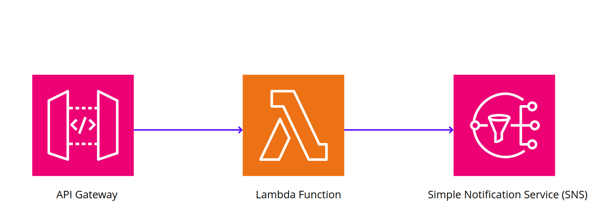

# AWS Lambda with API Gateway and SNS Integration

This project demonstrates a powerful and professional integration of AWS Lambda with API Gateway and Amazon Simple Notification Service (SNS). The setup allows you to invoke a Lambda function through an API call, which then triggers an SNS email notification. This README provides a detailed walkthrough of the setup, code, and cleanup process.

## Overview

- **API Gateway**: Acts as the entry point for triggering the Lambda function.
- **Lambda Function**: Processes the incoming request and publishes a message to an SNS topic.
- **SNS**: Sends an email notification to subscribed users.

## General Design Solution: 




## Prerequisites

- AWS Account
- AWS CLI configured with appropriate permissions
- Python 3.x
- Boto3 library

## Setup Instructions

### 1. Create an SNS Topic
1. Navigate to the SNS console.
2. Click on "Create topic".
3. Enter a name for your topic (e.g., `MyTopic`).
4. Click "Create topic".

### 2. Create an SNS Subscription
1. Select the topic you just created.
2. Click on "Create subscription".
3. Choose "Email" as the protocol.
4. Enter the email address you want to subscribe.
5. Click "Create subscription".
6. Confirm the subscription by clicking the link in the confirmation email.

### 3. Create a Lambda Function
1. Navigate to the Lambda console.
2. Click on "Create function".
3. Choose "Author from scratch".
4. Enter a name for your function (e.g., `MyLambdaFunction`).
5. Choose Python 3.x as the runtime.
6. Click "Create function".

### 4. Add Lambda Code
1. In the Lambda function overview page, scroll down to the "Function code" section.
2. Replace the existing code with the following:

```python
import boto3

def lambda_handler(event, context):
    # Initialize SNS client
    sns = boto3.client('sns')

    # Specify your SNS topic ARN
    topic_arn = 'arn:aws:sns:us-east-1:211125437318:MyTopic'

    # Publish a message to the SNS topic
    sns.publish(
        TopicArn=topic_arn,
        Message='Hello from Lambda! This is the message that will be sent in the email.',
        Subject='Email Subject from Lambda'
    )

    return {
        'statusCode': 200,
        'body': 'Message published to SNS topic successfully!'
    }
```
3. Click "Deploy" to save the changes.

### 5. Add API Gateway Trigger
1. In the Lambda function overview page, click on "Add trigger".
2. Select "API Gateway" from the trigger list.
3. Choose "Create a new API".
4. Select "HTTP API".
5. Click "Add".

### 6. Test the API
1. In the API Gateway console, find the API you created.
2. Copy the API endpoint URL.
3. Use a tool like Postman or `curl` to send a GET request to the API endpoint.
4. Check your email for the notification sent by SNS.

## 7. Clean Up

### Delete Lambda Function:
1. Navigate to the Lambda console.
2. Select the function you created.
3. Click "Delete".

### Delete SNS Topic:
1. Navigate to the SNS console.
2. Select the topic you created.
3. Click "Delete".

### Delete API:
1. Navigate to the API Gateway console.
2. Select the API you created.
3. Click "Delete".

## Conclusion
This project showcases a robust integration of AWS services to automate email notifications triggered by API calls. By following this guide, you have demonstrated a high level of technical proficiency in AWS Lambda, API Gateway, and SNS. This setup can be extended and customized for various use cases, such as notifications for system alerts, user activity, and more.

