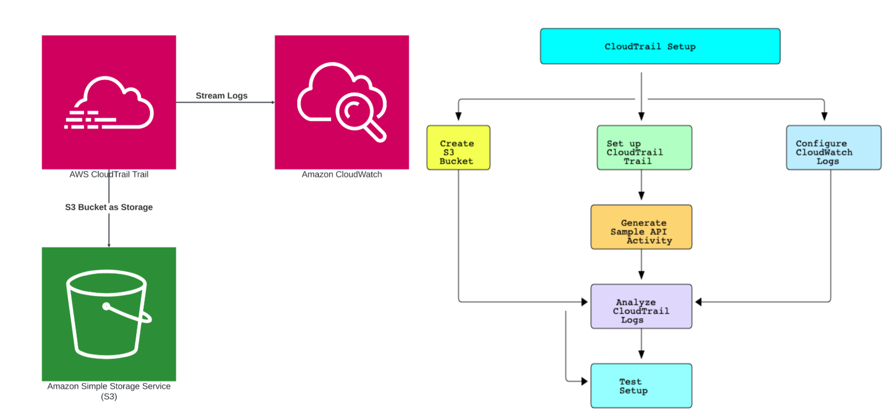

# AWS CloudTrail with S3 and CloudWatch Integration

This project demonstrates a robust and professional setup of AWS CloudTrail, integrated with Amazon S3 for log storage and Amazon CloudWatch for log analysis. The setup ensures comprehensive monitoring and logging of API activity across your AWS environment. This README provides a detailed guide to setting up, testing, and cleaning up the environment.

## Overview

- **AWS CloudTrail**: Enables governance, compliance, operational auditing, and risk auditing of your AWS account.
- **Amazon S3**: Provides scalable storage for CloudTrail logs.
- **Amazon CloudWatch**: Monitors and analyzes logs in real-time.

## Prerequisites

- AWS Account
- AWS CLI configured with appropriate permissions
- Basic knowledge of AWS services and IAM



## Setup Instructions

### 1. Create an S3 Bucket for CloudTrail Logs
1. Navigate to the S3 console.
2. Click on **"Create bucket"**.
3. Enter a unique bucket name (e.g., `cloudtrail-logs-bucket`).
4. Choose the region and configure settings as needed.
5. Click **"Create bucket"**.

### 2. Set Up a CloudTrail Trail
1. Navigate to the CloudTrail console.
2. Click on **"Create trail"**.
3. Enter a trail name (e.g., `MyCloudTrail`).
4. Choose **"Create a new S3 bucket"** or select an existing bucket.
5. Enable **"Log file validation"** and **"Log file SSE-KMS encryption"** if required.
6. Configure CloudWatch Logs integration:
   - Enable **"Send to CloudWatch Logs"**.
   - Create a new CloudWatch Logs group or select an existing one.
7. Review and click **"Create trail"**.

### 3. Generate Sample API Activity
1. Navigate to the IAM console.
2. Create a test user (`test-user`).
3. Create a test S3 bucket (`test-bucket-987928`).
4. Perform some actions using the test user (e.g., upload a file to the test bucket).

### 4. Analyze CloudTrail Logs
1. Navigate to the CloudTrail console.
2. Go to **"Event history"** to view the API activities.
3. Search for events related to the test user (`test-user`).

### 5. Configure CloudWatch Logs
1. Navigate to the CloudWatch console.
2. Select the Logs group created for CloudTrail.
3. Use CloudWatch Logs Insights to query logs:

   ```
   {$.userIdentity.userName = "test-user"}
   ```

### 6. Test the Setup
- Verify that logs are being stored in the S3 bucket.
- Check CloudWatch Logs for real-time monitoring and analysis.
- Ensure that all API activities are logged and can be queried.

## Clean Up

### Delete CloudTrail Trail
1. Navigate to the CloudTrail console.
2. Select your trail (`MyCloudTrail`).
3. Click **"Delete"**.

### Delete Test Bucket
1. Navigate to the S3 console.
2. Select the test bucket (`test-bucket-987928`).
3. Click **"Delete"**.

### Empty and Delete CloudTrail Bucket
1. Navigate to the S3 console.
2. Select the CloudTrail logs bucket (`cloudtrail-logs-bucket`).
3. Empty the bucket and then delete it.

### Delete CloudWatch Log Group
1. Navigate to the CloudWatch console.
2. Select the Logs group created for CloudTrail.
3. Click **"Delete log group"**.

### Delete Test User
1. Navigate to the IAM console.
2. Select the test user (`test-user`).
3. Click **"Delete user"**.

### Delete IAM Role and KMS Key (if created)
1. Navigate to the IAM console.
2. Delete any roles or keys created for this setup.

## Conclusion

This project demonstrates a powerful and professional setup of AWS CloudTrail integrated with S3 and CloudWatch. By following this guide, you have showcased advanced technical skills in monitoring, logging, and analyzing API activities in a secure and scalable manner. This setup can be extended for various applications, including compliance auditing, security monitoring, and operational troubleshooting.

