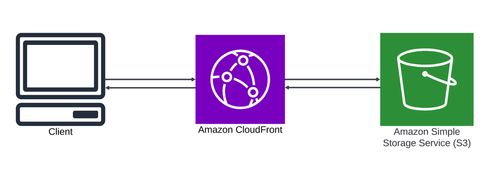

# Amazon CloudFront with S3 Integration

This project demonstrates a robust and professional setup of Amazon CloudFront integrated with an S3 bucket to serve content globally with low latency and high transfer speeds. The setup includes creating a CloudFront distribution, configuring S3 bucket policies, and testing the distribution. This README provides a detailed guide to setting up, testing, and cleaning up the environment.

## Overview
- **Amazon S3**: Provides scalable storage for static content.
- **Amazon CloudFront**: A content delivery network (CDN) that delivers content to users with low latency and high transfer speeds.
- **Static Website Hosting**: Serve static HTML content through CloudFront.

## General Design Solution: 




## Prerequisites
- AWS Account
- AWS CLI configured with appropriate permissions
- Basic knowledge of S3, CloudFront, and HTML

## Setup Instructions

### 1. Create an S3 Bucket and Upload a Sample HTML File
1. Navigate to the S3 console.
2. Click on "Create bucket".
3. Enter a unique bucket name (e.g., `my-cloudfront-demo-bucket-567444`).
4. Choose the region and configure settings as needed.
5. Click "Create bucket".

Create an `index.html` file with the following content:

```html
<!DOCTYPE html>
<html lang="en">
<head>
    <meta charset="UTF-8">
    <meta name="viewport" content="width=device-width, initial-scale=1.0">
    <title>CloudFront Demo</title>
</head>
<body>
    <h1>Hello from CloudFront!</h1>
    <p>This content is being served through Amazon CloudFront.</p>
</body>
</html>
```

Upload the `index.html` file to the S3 bucket.

### 2. Create a CloudFront Distribution
1. Navigate to the CloudFront console.
2. Click on "Create distribution".
3. Choose "Web" as the delivery method.
4. Configure the origin:
   - **Origin domain**: Select your S3 bucket (`my-cloudfront-demo-bucket-567444.s3.amazonaws.com`).
   - **Origin access**: Create a new Origin Access Control (OAC).
5. Configure default cache behavior settings.
6. Enable Web Application Firewall (WAF) if required.
7. Click "Create distribution".

### 3. Configure the S3 Bucket Policy
1. Navigate to the S3 console.
2. Select your bucket (`my-cloudfront-demo-bucket-567444`).
3. Go to the "Permissions" tab.
4. Edit the bucket policy and paste the following policy:

```json
{
  "Version": "2008-10-17",
  "Id": "PolicyForCloudFrontPrivateContent",
  "Statement": [
    {
      "Sid": "AllowCloudFrontServicePrincipal",
      "Effect": "Allow",
      "Principal": {
        "Service": "cloudfront.amazonaws.com"
      },
      "Action": "s3:GetObject",
      "Resource": "arn:aws:s3:::my-cloudfront-demo-bucket-567444/*",
      "Condition": {
        "StringEquals": {
          "AWS:SourceArn": "arn:aws:cloudfront::651623850282:distribution/E1P8MNW9G4879Z"
        }
      }
    }
  ]
}
```

5. Save the changes.

### 4. Test the CloudFront Distribution
1. Once the CloudFront distribution is deployed, copy the distribution URL.
2. Append `/index.html` to the URL and paste it into a web browser.
3. You should see the content of your `index.html` file served through CloudFront.

### 5. Enable Additional CloudFront Features
- Explore additional CloudFront features such as cache behavior settings, geo-restrictions, and custom SSL certificates.
- Configure these settings as needed for your use case.

## Clean Up

### Disable the CloudFront Distribution:
1. Navigate to the CloudFront console.
2. Select your distribution.
3. Click "Disable".

### Delete the CloudFront Distribution:
1. Wait for the distribution to be fully disabled.
2. Click "Delete".

### Empty the S3 Bucket:
1. Navigate to the S3 console.
2. Select your bucket (`my-cloudfront-demo-bucket-567444`).
3. Click "Empty bucket".

### Delete the S3 Bucket:
1. Navigate to the S3 console.
2. Select your bucket (`my-cloudfront-demo-bucket-567444`).
3. Click "Delete".

## Conclusion
This project demonstrates a powerful and professional setup of Amazon CloudFront integrated with S3 to serve static content globally. By following this guide, you have showcased advanced technical skills in configuring and managing CDN solutions for optimal content delivery. This setup can be extended for various applications, including web hosting, media distribution, and more.

