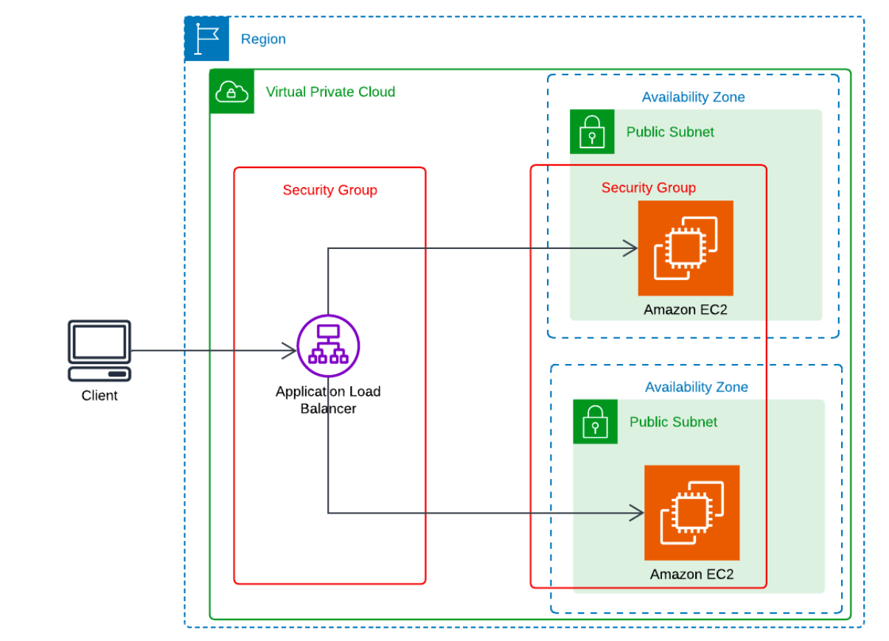

# Elastic Load Balancer (ELB) with EC2 Instances in a VPC

This project demonstrates a robust and professional setup of an Application Load Balancer (ALB) in AWS, integrated with EC2 instances within a Virtual Private Cloud (VPC). The setup ensures high availability and scalability for web applications by distributing incoming traffic across multiple instances. This README provides a detailed guide to setting up, testing, and cleaning up the environment.

## Overview
- **Amazon VPC**: Provides a logically isolated section of the AWS Cloud where you can launch AWS resources.
- **Amazon EC2**: Provides scalable computing capacity in the AWS Cloud.
- **Application Load Balancer (ALB)**: Distributes incoming application traffic across multiple targets, such as EC2 instances, in multiple Availability Zones.

## Prerequisites
- AWS Account
- AWS CLI configured with appropriate permissions
- Basic knowledge of VPC, EC2, and ALB



## Setup Instructions

### 1. Create a VPC with Two Public Subnets
1. Navigate to the **VPC console**.
2. Click on **Create VPC**.
3. Enter a name for your VPC (e.g., `ELB-Demo-VPC`).
4. Configure the CIDR block (e.g., `10.0.0.0/16`).
5. Click **Create VPC**.
6. Create two public subnets:
   - **Subnet 1**: `10.0.1.0/24` in Availability Zone 1
   - **Subnet 2**: `10.0.2.0/24` in Availability Zone 2

### 2. Launch Two EC2 Instances with a Basic Web Server
1. Navigate to the **EC2 console**.
2. Click on **Launch Instance**.
3. Choose an Amazon Machine Image (AMI) (e.g., **Amazon Linux 2**).
4. Select an instance type (e.g., `t2.micro`).
5. Configure network settings to use the VPC and one of the public subnets.
6. Create a new key pair (`ELB-Demo-KeyPair`) and download it.
7. In the **Advanced Details** section, add the following user data:

```bash
#!/bin/bash
yum update -y
yum install -y httpd
systemctl start httpd
systemctl enable httpd
echo "<h1>Hello from $(hostname -f)</h1>" > /var/www/html/index.html
```

8. Launch the instance (`ELB-Demo-Instance-1`).
9. Repeat the steps to launch a second instance (`ELB-Demo-Instance-2`) in the other public subnet.

### 3. Create a Security Group for the EC2 Instances
1. Navigate to the **EC2 console**.
2. Click on **Security Groups**.
3. Click **Create security group**.
4. Enter a name (e.g., `ELB-Demo-EC2-SG`).
5. Configure inbound rules to allow **HTTP traffic (port 80) from anywhere**.
6. Click **Create security group**.
7. Attach this security group to both EC2 instances.

### 4. Create an Application Load Balancer
1. Navigate to the **EC2 console**.
2. Click on **Load Balancers**.
3. Click **Create Load Balancer**.
4. Choose **Application Load Balancer**.
5. Enter a name (e.g., `ELB-Demo-ALB`).
6. Configure the network settings to use the VPC and both public subnets.
7. Create a new security group (`ELB-Demo-ALB-SG`) to allow **HTTP traffic from anywhere**.
8. Configure the target group:
   - **Name**: `ELB-Demo-TG`
   - **Target type**: Instance
   - **Protocol**: HTTP
   - **Port**: 80
9. Register both EC2 instances as targets.
10. Review and click **Create load balancer**.

### 5. Modify EC2 Security Group to Allow Incoming Traffic from ALB
1. Navigate to the **EC2 console**.
2. Select the security group (`ELB-Demo-EC2-SG`).
3. Add an inbound rule to allow **HTTP traffic from the ALB security group (`ELB-Demo-ALB-SG`)**.

## Test the Load Balancer
1. Copy the **DNS name** of the ALB.
2. Paste the DNS name into a web browser with `http://` prefixed.
3. Refresh the page a few times to see the load balancer distributing traffic between the two EC2 instances.

## Clean Up
### Delete Load Balancer:
1. Navigate to the **EC2 console**.
2. Select the load balancer (`ELB-Demo-ALB`).
3. Click **Delete**.

### Delete Target Group:
1. Navigate to the **EC2 console**.
2. Select the target group (`ELB-Demo-TG`).
3. Click **Delete**.

### Terminate EC2 Instances:
1. Navigate to the **EC2 console**.
2. Select the instances (`ELB-Demo-Instance-1` and `ELB-Demo-Instance-2`).
3. Click **Terminate**.

### Delete Security Groups:
1. Navigate to the **EC2 console**.
2. Select the security groups (`ELB-Demo-EC2-SG` and `ELB-Demo-ALB-SG`).
3. Click **Delete**.

### Delete VPC:
1. Navigate to the **VPC console**.
2. Select the VPC (`ELB-Demo-VPC`).
3. Click **Delete VPC**.

## Conclusion
This project demonstrates a powerful and professional setup of an **Application Load Balancer** integrated with **EC2 instances in a VPC**. By following this guide, you have showcased advanced technical skills in configuring and managing **scalable, high-availability web applications**. This setup can be extended for various applications, including **web hosting, microservices, and more**.

