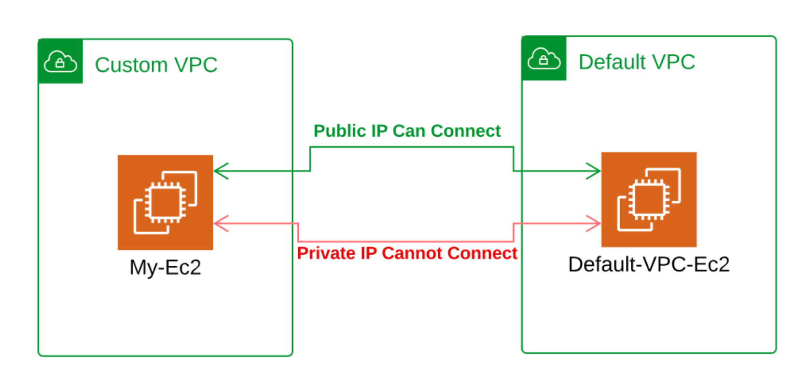

# Amazon VPC Project Readme

## Overview
This project demonstrates the creation and configuration of a custom Amazon Virtual Private Cloud (VPC) and its components. It also includes launching EC2 instances within both custom and default VPCs, testing connectivity between them, and performing cleanup operations. The project is designed to provide a comprehensive understanding of VPC setup, configuration, and management in AWS.

## Project Components

### 1. Custom VPC Creation
- **Custom VPC Configuration:** A custom VPC is created with specific configurations to meet project requirements.
- **VPC Workflow:** The workflow includes creating essential components such as subnets, route tables, internet gateways, and security groups.
- **Resource Map View:** After creation, the resource map view is used to visualize the components within the custom VPC.
- **Custom VPC Summary:** A summary of the custom VPC configuration is provided, detailing the CIDR block, subnets, and other relevant settings.

### 2. Launching EC2 Instances
- **EC2 Instance in Custom VPC:** An EC2 instance named "My-Ec2" is launched within the custom VPC.
- **Key Pair Creation:** A key pair named "my-key-pair-1" is created for secure SSH access to the instance.
- **Public Subnet Selection:** The instance is placed in a public subnet within the custom VPC with auto-assigned public IP enabled.
- **Instance Summary:** The public and private IP addresses of the instance are noted for connectivity tests.
- **EC2 Instance in Default VPC:** Another EC2 instance named "Default-VPC-Ec2" is launched within the default VPC for connectivity testing.

### 3. Connectivity Testing
- **Custom VPC to Default VPC:**
  - SSH into the custom VPC instance using the key pair.
  - Install `nc` (Netcat) for network connectivity testing.
  - Test connectivity to the default VPC instance using both public and private IP addresses.
- **Default VPC to Custom VPC:**
  - SSH into the default VPC instance using the key pair.
  - Install `nc` for network connectivity testing.
  - Test connectivity to the custom VPC instance using both public and private IP addresses.

### 4. Cleanup
- **Delete EC2 Instances:** Both EC2 instances ("My-Ec2" and "Default-VPC-Ec2") are terminated to avoid unnecessary charges.
- **Delete Custom VPC:** The custom VPC and its associated components are deleted to clean up the environment.

## Detailed Steps

### Step 1: Create Custom VPC
1. Navigate to the VPC dashboard in the AWS Management Console.
2. Click on "Create VPC" and configure the VPC settings (CIDR block, tenancy, etc.).
3. Create subnets, route tables, and an internet gateway as part of the VPC setup.
4. Review the resource map to ensure all components are correctly configured.

### Step 2: Launch EC2 Instances
1. In the EC2 dashboard, click on "Launch Instance."
2. Select an Amazon Machine Image (AMI) and instance type.
3. Configure the instance details, ensuring the custom VPC and public subnet are selected.
4. Enable auto-assign public IP and proceed to add storage and configure security groups.
5. Review and launch the instance, creating a new key pair if necessary.

### Step 3: Connectivity Testing
1. SSH into the custom VPC instance using the key pair.
2. Install `nc` using `sudo yum install nc`.
3. Use `nc -zv <IP> <port>` to test connectivity to the default VPC instance.
4. Repeat the process from the default VPC instance to the custom VPC instance.

### Step 4: Cleanup
1. Terminate both EC2 instances from the EC2 dashboard.
2. Delete the custom VPC and all associated components from the VPC dashboard.

## Conclusion
This project provides a hands-on approach to understanding Amazon VPC, EC2 instance deployment, and network connectivity within AWS. By following the steps outlined, you will gain practical experience in managing AWS resources effectively.

