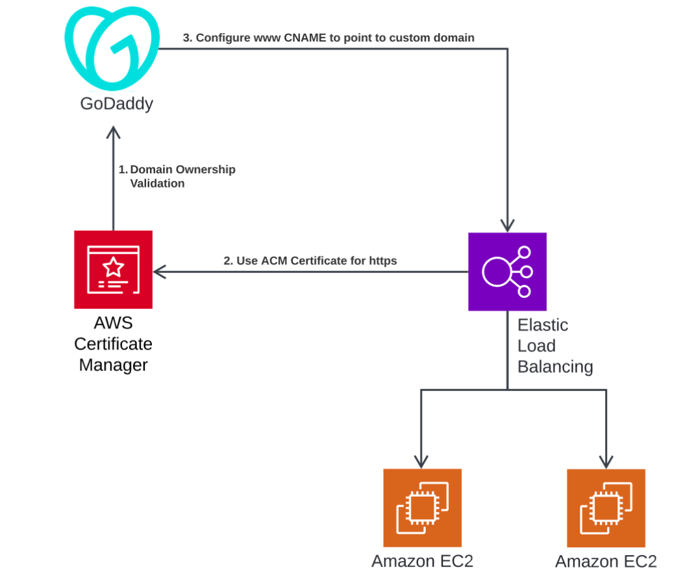

# AWS Certificate Manager Demo

## Overview
This project demonstrates the integration of AWS Certificate Manager (ACM) with an Amazon EC2 instance and an Application Load Balancer (ALB) to secure a web application using SSL/TLS certificates. The project walks through the process of requesting a public SSL/TLS certificate, deploying a simple web application, setting up an ALB, and associating the ACM certificate with the ALB. Finally, the setup is tested, and resources are cleaned up to avoid unnecessary charges.

## Prerequisites
- An AWS account with necessary permissions to create and manage EC2 instances, ACM certificates, ALBs, and Route 53 records.
- A registered domain name (e.g., `alaa.pro`) with access to its DNS settings (e.g., via GoDaddy).



## Steps

### 1. Request a Public SSL/TLS Certificate Using ACM
- Navigate to AWS Certificate Manager in the AWS Management Console.
- Request a public certificate for your domain (e.g., `*.alaa.pro`).
- Validate the domain ownership by adding the provided CNAME record to your domain's DNS settings in GoDaddy.

### 2. Create a Simple Web Application Using EC2
- Launch an EC2 instance named `Certificate-Manager-Demo`.
- **Configure Network Settings:**
  - Allow HTTP (port 80) and HTTPS (port 443) traffic in the security group.
- **Add User Data** to install and configure a web server:
  
  ```bash
  #!/bin/bash
  yum update -y
  yum install -y httpd
  systemctl start httpd
  systemctl enable httpd
  echo "<h1>Hello from AWS Certificate Manager Demo!</h1>" > /var/www/html/index.html
  ```

### 3. Set Up an Application Load Balancer
- Create an Application Load Balancer named `SecureALB`.
- **Configure Security Groups** to allow HTTP and HTTPS traffic.
- **Create a Target Group** named `My-EC2-Target-Group` and register the EC2 instance.
- **Configure Health Checks** to ensure the instance is healthy.
- Link the ALB to the target group for both HTTP (port 80) and HTTPS (port 443).

### 4. Associate the ACM Certificate with the ALB
- Associate the ACM certificate with the ALB to enable HTTPS.
- Review and create the load balancer.

### 5. Test the Setup
#### Direct EC2 Access:
- Access the EC2 instance directly via its public IP (e.g., `http://<EC2_IP>`). This should display *"Hello from AWS Certificate Manager Demo!"* but will not be secure.

#### HTTP Access via ALB:
- Access the ALB via HTTP (e.g., `http://<ALB_IP>`). This should also display the message but will not be secure.

#### HTTPS Access via ALB:
- Access the ALB via HTTPS (e.g., `https://<ALB_IP>`). This should display the message securely.

### 6. Configure DNS for Custom Domain
- **Create a Hosted Zone** in AWS Route 53 for `www.alaa.pro`.
- **Create a Record** to point `www.alaa.pro` to the ALB.
- **Wait for DNS Propagation** (30-60 minutes).

#### Test the Custom Domain:
- Access `http://www.alaa.pro` and `https://www.alaa.pro` to ensure they resolve correctly and securely.

### 7. Clean Up Resources
- Terminate the EC2 instance.
- Delete the Application Load Balancer.
- Delete the Target Group.
- Delete the Security Groups.
- Delete the ACM Certificate.

## Conclusion
This project showcases the power of AWS Certificate Manager in securing web applications with SSL/TLS certificates. By following these steps, you can deploy a secure web application using AWS services like EC2, ALB, and Route 53. This setup ensures that your application is accessible securely via HTTPS, providing a safe experience for your users.

