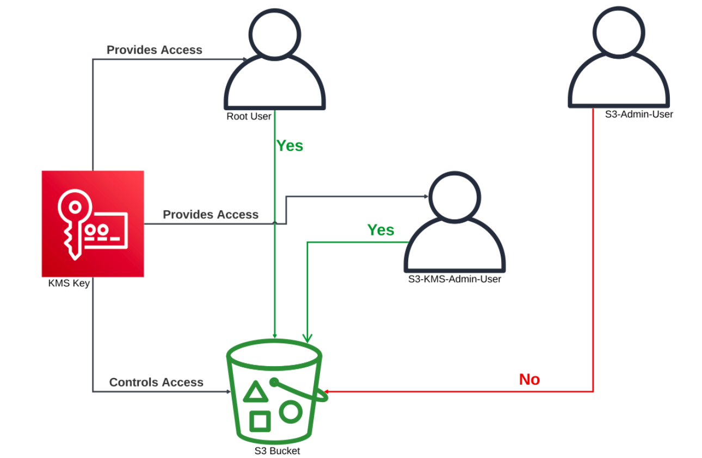

# AWS Key Management Service (KMS) Demo

## Overview
This project demonstrates the use of AWS Key Management Service (KMS) to manage encryption keys and secure data stored in Amazon S3. The project walks through the creation of a customer-managed key (CMK), setting up an S3 bucket with default encryption using the KMS key, and testing access control with different IAM users. The goal is to ensure that only authorized users can access encrypted data, showcasing the security capabilities of AWS KMS and S3.

## General Design Solution: 




## Prerequisites
- An AWS account with necessary permissions to create and manage KMS keys, S3 buckets, and IAM users.
- Basic understanding of AWS IAM, S3, and KMS.

## Steps

### 1. Create a Customer Managed Key (CMK) in AWS KMS
- Navigate to AWS KMS in the AWS Management Console.
- Create a new key:
  - Select **Customer managed keys**.
  - Choose **Advanced options**.
  - Add a label (e.g., `my-s3-encryption-key`).
  - Optionally, add tags for better management.
  - Review the key policy and ensure it meets your security requirements.
  - Create the key.

### 2. Create an S3 Bucket and Enable Default Encryption with the KMS Key
- Navigate to Amazon S3 in the AWS Management Console.
- Create a new bucket:
  - Choose a unique bucket name.
  - Enable **Default encryption** and select the KMS key created earlier (`my-s3-encryption-key`).
  - Create the bucket.

### 3. Upload an Object to the S3 Bucket and Verify Encryption
- Create a test file:
  ```bash
  echo "kms encryption test file" > encryption-test-file.txt
  ```
- Upload the file to the S3 bucket:
  - Select the bucket.
  - Choose **Upload** and select the test file.
  - Under **Server-side encryption settings**, ensure the KMS key is selected.
  - Upload the file.
- Verify encryption:
  - Open the file in the S3 console.
  - Check the properties to confirm that the file is encrypted with the KMS key.

### 4. Test Access to the Encrypted Object
#### Create an S3 Admin User:
- Navigate to IAM in the AWS Management Console.
- Create a new user (e.g., `S3-Admin-User`).
- Assign the **AmazonS3FullAccess** policy.
- Create the user.

#### Test access:
- Log in as the `S3-Admin-User`.
- Attempt to access the encrypted file in the S3 bucket.
- Observe that access is denied because the user does not have KMS key usage permissions.

### 5. Create a KMS User and Test Access
#### Create a KMS User:
- Navigate to IAM in the AWS Management Console.
- Create a new user (e.g., `S3-KMS-Admin-User`).
- Assign the **AmazonS3FullAccess** policy.
- Create the user.

#### Assign KMS Key Usage Permissions:
- Navigate to KMS.
- Select the key (`my-s3-encryption-key`).
- Add the `S3-KMS-Admin-User` as a key user.

#### Test access:
- Log in as the `S3-KMS-Admin-User`.
- Attempt to access the encrypted file in the S3 bucket.
- Observe that access is granted because the user has KMS key usage permissions.

### 6. Clean Up Resources
#### Delete IAM Users:
- Navigate to IAM.
- Delete the `S3-Admin-User` and `S3-KMS-Admin-User`.

#### Empty the S3 Bucket:
- Navigate to S3.
- Select the bucket and delete all objects.

#### Delete the S3 Bucket:
- Delete the bucket.

#### Delete the KMS Key:
- Navigate to KMS.
- Schedule the deletion of the `my-s3-encryption-key`.

## Conclusion
This project showcases the power of AWS KMS in managing encryption keys and securing data in S3. By following these steps, you can ensure that only authorized users with the necessary permissions can access encrypted data, enhancing the security of your AWS environment.

