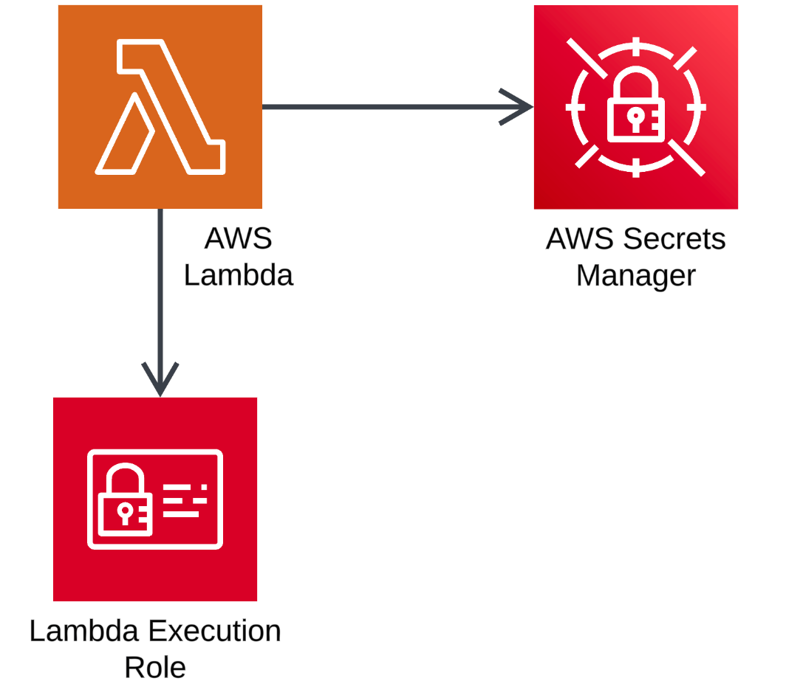

# AWS Secrets Manager Demo

## Overview
This project demonstrates the use of AWS Secrets Manager to securely store, retrieve, and manage sensitive information such as database credentials. The project walks through the creation of a secret, the development of a Lambda function to access the secret, and the testing of the Lambda function. The goal is to showcase how AWS Secrets Manager can be integrated with AWS Lambda to securely manage and use sensitive data in a serverless environment.

## General Design Solution: 




## Prerequisites
- An AWS account with necessary permissions to create and manage Secrets Manager secrets, Lambda functions, and IAM roles.
- Basic understanding of AWS Lambda, IAM, and Secrets Manager.

## Steps

### 1. Create a Secret in AWS Secrets Manager
Navigate to AWS Secrets Manager in the AWS Management Console.

#### Create a new secret:
- Choose **Other type of secrets**.
- Add a key-value pair (e.g., `admin` as the key and `MySecurePassword123!` as the value).
- Provide a **Secret name** (e.g., `demo/db/credentials`).
- Optionally, add a description.
- Review and create the secret.

#### Configure rotation schedule (optional):
- Set up automatic rotation if needed.

### 2. Retrieve and Use the Secret
#### Retrieve the secret value:
- Navigate to the secret in the Secrets Manager console.
- Retrieve the secret value to verify its contents.

### 3. Create a Lambda Function to Access the Secret
Navigate to AWS Lambda in the AWS Management Console.

#### Create a new Lambda function:
- Choose **Author from scratch**.
- Provide a function name (e.g., `SecretsManagerDemo`).
- Choose a runtime (e.g., **Python 3.8**).
- Create the function.

#### Add the following code to the Lambda function:
```python
import json
import boto3
from botocore.exceptions import ClientError

def get_secret():
    secret_name = "demo/db/credentials"
    region_name = "us-east-1"
    
    # Create a Secrets Manager client
    session = boto3.session.Session()
    client = session.client(
        service_name='secretsmanager',
        region_name=region_name
    )
    
    try:
        get_secret_value_response = client.get_secret_value(
            SecretId=secret_name
        )
    except ClientError as e:
        raise e
    
    # Decrypts secret using the associated KMS key.
    secret = get_secret_value_response['SecretString']
    
    return json.loads(secret)

def lambda_handler(event, context):
    try:
        secret_dict = get_secret()
        
        # Print the entire secret structure for debugging
        print(f"Secret structure: {json.dumps(secret_dict)}")
        
        # In this case, the username is the key and the password is the value
        username = list(secret_dict.keys())[0]
        password = secret_dict[username]
        
        return {
            'statusCode': 200,
            'body': json.dumps(f"Successfully retrieved secret. Username: {username}, Password: {password}")
        }
    except Exception as e:
        print(f"Error: {str(e)}")
        return {
            'statusCode': 500,
            'body': json.dumps(f"Error retrieving secret: {str(e)}")
        }
```

#### Edit the Execution Role:
- Navigate to the **Execution role** section.
- Create a new inline policy:
  - Provide a policy name (e.g., `SecretsManagerDemoPolicy`).
  - Add the following policy document:

```json
{
    "Version": "2012-10-17",
    "Statement": [
        {
            "Effect": "Allow",
            "Action": "secretsmanager:GetSecretValue",
            "Resource": "arn:aws:secretsmanager:us-east-1:123456789012:secret:demo/db/credentials"
        }
    ]
}
```

- Review and create the policy.

### 4. Test the Lambda Function
#### Test the Lambda function:
- Navigate to the Lambda function.
- Configure a test event (optional).
- Invoke the function.
- Review the execution result to ensure the secret is retrieved successfully.

### 5. Clean Up Resources
#### Delete the secret:
- Navigate to **Secrets Manager**.
- Delete the secret (`demo/db/credentials`).

#### Delete the Lambda function:
- Navigate to **Lambda**.
- Delete the function (`SecretsManagerDemo`).

#### Delete the Lambda Execution Role:
- Navigate to **IAM**.
- Delete the role (`SecretsManagerDemo-role`).

## Conclusion
This project showcases the power of AWS Secrets Manager in securely managing sensitive information and integrating it with AWS Lambda. By following these steps, you can ensure that sensitive data such as database credentials are securely stored and accessed, enhancing the security of your AWS environment.

