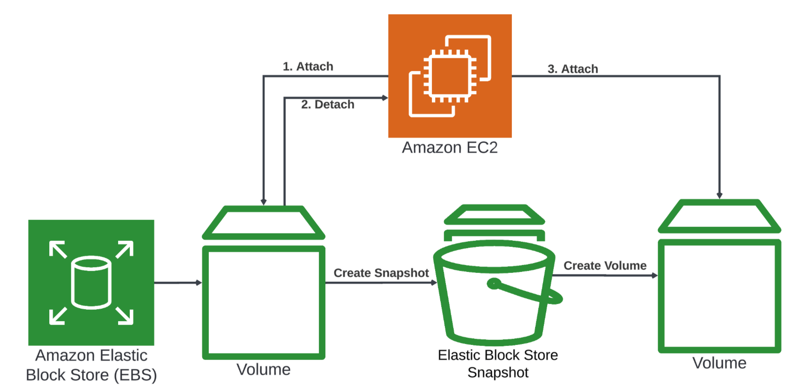

# Amazon Elastic Block Store (EBS) Demo

## Overview
This project demonstrates the use of Amazon Elastic Block Store (EBS) to create, attach, and manage storage volumes for Amazon EC2 instances. The project walks through the process of launching an EC2 instance, creating and attaching an EBS volume, formatting and mounting the volume, writing data to it, creating a snapshot, and testing the setup. The goal is to showcase the flexibility and power of EBS in managing persistent storage for EC2 instances.

## Prerequisites
- An AWS account with necessary permissions to create and manage EC2 instances, EBS volumes, and snapshots.
- Basic understanding of Amazon EC2 and EBS.



## Steps

### 1. Launch an EC2 Instance
Navigate to Amazon EC2 in the AWS Management Console.

**Launch a new instance:**
- Choose an Amazon Machine Image (AMI) (e.g., Amazon Linux 2).
- Select an instance type (e.g., `t2.micro`).
- Configure instance details.
- Create a new key pair (e.g., `ebs-demo-key-pair-1`) and download it.
- Launch the instance (e.g., `ebs-demo-1`).

### 2. Create and Attach an EBS Volume
Navigate to Amazon EBS in the AWS Management Console.

**Create a new volume:**
- Specify the size and type of the volume.
- Select the same Availability Zone as the EC2 instance.
- Create the volume.

**Attach the volume to the EC2 instance:**
- Select the volume and choose **Actions > Attach Volume**.
- Select the EC2 instance (`ebs-demo-1`) and specify the device name (e.g., `/dev/xvdf`).
- Attach the volume.

### 3. Connect to the EC2 Instance
Connect to the EC2 instance using SSH:
```bash
ssh -i ebs-demo-key-pair-1.pem ec2-user@<EC2_Public_IP>
```

### 4. Format and Mount the EBS Volume
**List block devices to identify the new volume:**
```bash
lsblk
```

**Format the volume:**
```bash
sudo mkfs -t ext4 /dev/xvdf
```

**Create a mount point:**
```bash
sudo mkdir /mnt/ebs-volume
```

**Mount the volume:**
```bash
sudo mount /dev/xvdf /mnt/ebs-volume
```

**Verify the mount:**
```bash
df -h
```

**Set permissions:**
```bash
sudo chown ec2-user:ec2-user /mnt/ebs-volume
sudo chmod 755 /mnt/ebs-volume
```

### 5. Write Data to the EBS Volume
**Navigate to the mount point:**
```bash
cd /mnt/ebs-volume
```

**Create a test file:**
```bash
echo 'This is a test file on my EBS volume' > /mnt/ebs-volume/test_file.txt
```

**Verify the file:**
```bash
cat test_file.txt
```

### 6. Create an EBS Snapshot
Navigate to Amazon EBS in the AWS Management Console.

**Create a snapshot:**
- Select the volume and choose **Actions > Create Snapshot**.
- Provide a name (e.g., `Snapshot of EBS-Demo-Volume`).
- Add tags (e.g., `Key: Name, Value: EBS-Demo-Snapshot`).
- Create the snapshot.

### 7. Test the Setup
**Unmount the volume:**
```bash
sudo umount /mnt/ebs-volume
```

**Detach the volume from the EC2 instance.**

**Create a new volume from the snapshot:**
- Navigate to the snapshot and choose **Actions > Create Volume**.
- Specify the size and Availability Zone.
- Create the volume.

**Attach the new volume to the EC2 instance.**

**Mount the new volume:**
```bash
sudo mount /dev/xvdf /mnt/ebs-volume
```

**Verify the data:**
```bash
cat /mnt/ebs-volume/test_file.txt
```

### 8. Clean Up Resources
- Force detach the volume from the EC2 instance.
- Delete the volume.
- Delete the snapshot.
- Terminate the EC2 instance.
- Delete the security group associated with the instance.

## Conclusion
This project showcases the power and flexibility of Amazon EBS in managing persistent storage for EC2 instances. By following these steps, you can create, attach, and manage EBS volumes, ensuring data persistence and availability. The ability to create snapshots provides an additional layer of data protection and recovery.

