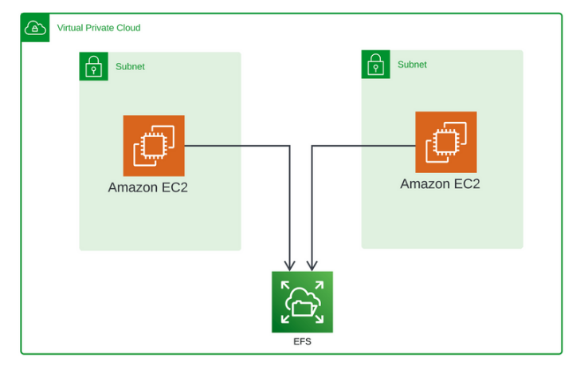

# Amazon Elastic File System (EFS) Demo

## Overview
This project demonstrates the use of Amazon Elastic File System (EFS) to create a scalable and shared file storage system that can be accessed by multiple Amazon EC2 instances across different Availability Zones. The project walks through the process of creating a VPC with public subnets, launching EC2 instances, creating and configuring an EFS file system, mounting the file system on EC2 instances, and testing file sharing between instances. The goal is to showcase the flexibility and scalability of EFS in managing shared file storage for distributed applications.

## General Design Solution: 




## Prerequisites
- An AWS account with necessary permissions to create and manage VPCs, EC2 instances, and EFS file systems.
- Basic understanding of Amazon VPC, EC2, and EFS.

## Steps

### 1. Create a VPC with Public Subnets
1. Navigate to Amazon VPC in the AWS Management Console.
2. Create a new VPC:
   - Specify the VPC name and CIDR block (e.g., `10.0.0.0/16`).
   - Create the VPC.
3. Create public subnets:
   - Create subnets in different Availability Zones (e.g., `10.0.1.0/24` in `us-east-1a` and `10.0.2.0/24` in `us-east-1b`).
   - Enable Auto-assign Public IP for each subnet.

### 2. Launch EC2 Instances in Different Availability Zones
1. Navigate to Amazon EC2 in the AWS Management Console.
2. Launch the first instance (`EFS-Demo-Instance-1`):
   - Choose an Amazon Machine Image (AMI) (e.g., Amazon Linux 2).
   - Select an instance type (e.g., `t2.micro`).
   - Configure instance details and select the first subnet.
   - Create a new key pair (e.g., `EFS-Demo-Key-Pair`) and download it.
   - Configure security group to allow SSH access.
   - Launch the instance.
3. Launch the second instance (`EFS-Demo-Instance-2`):
   - Repeat the steps for the first instance but select the second subnet.
   - Use the existing key pair (`EFS-Demo-Key-Pair`) and security group.

### 3. Create and Configure an Amazon EFS File System
1. Navigate to Amazon EFS in the AWS Management Console.
2. Create a new file system:
   - Provide a name (e.g., `EFS-Demo-FileSystem`).
   - Select the VPC and subnets created earlier.
   - Create the file system.
3. Configure file system settings:
   - Disable Automatic backups.
   - Set Performance mode to General Purpose.
   - Enable Encryption at rest.
   - Save changes.

### 4. Mount the EFS File System on EC2 Instances
1. Edit inbound rules of the default security group:
   - Add a rule to allow NFS traffic (port `2049`) from the VPC CIDR block (`10.0.0.0/16`).
2. Connect to the first EC2 instance (`EFS-Demo-Instance-1`):
   ```bash
   ssh -i EFS-Demo-Key-Pair.pem ec2-user@<EC2_Public_IP>
   ```
3. Install the EFS utilities:
   ```bash
   sudo yum install -y amazon-efs-utils
   ```
4. Create a mount point:
   ```bash
   sudo mkdir /efs
   ```
5. Mount the EFS file system:
   ```bash
   sudo mount -t efs -o tls fs-<EFS_ID>:/ /efs
   ```
6. Verify the mount:
   ```bash
   mount | grep efs
   df -h
   ```

### 5. Test File Sharing Between Instances
1. Create a test file on the first instance:
   ```bash
   echo "Hello from Instance 1" | sudo tee /efs/testfile.txt
   ```
2. Connect to the second EC2 instance (`EFS-Demo-Instance-2`):
   ```bash
   ssh -i EFS-Demo-Key-Pair.pem ec2-user@<EC2_Public_IP>
   ```
3. Mount the EFS file system (repeat steps `4.3` to `4.5`).
4. Verify the test file:
   ```bash
   cat /efs/testfile.txt
   ```
5. Create another test file on the second instance:
   ```bash
   echo "Hello from Instance 2" | sudo tee /efs/testfile2.txt
   ```
6. Verify the new test file on the first instance:
   ```bash
   cat /efs/testfile2.txt
   ```

### 6. Clean Up Resources
1. Terminate EC2 instances:
   - Navigate to EC2.
   - Terminate `EFS-Demo-Instance-1` and `EFS-Demo-Instance-2`.
2. Delete the EFS file system:
   - Navigate to EFS.
   - Delete `EFS-Demo-FileSystem`.
3. Delete the VPC:
   - Navigate to VPC.
   - Delete the VPC and associated subnets.

## Conclusion
This project showcases the power and flexibility of Amazon EFS in managing shared file storage for distributed applications. By following these steps, you can create a scalable and shared file system that can be accessed by multiple EC2 instances across different Availability Zones, ensuring data consistency and availability.

